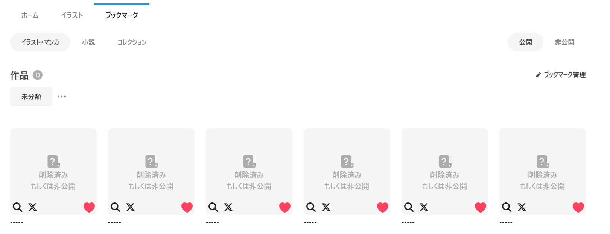

# pixivの削除されたブックマークを追跡する拡張機能

pixivの削除済みもしくは非公開のブックマークに検索ボタンを追加します。

## 機能

- 削除済みもしくは非公開のブックマークのURLで検索可能なボタンを追加し、誰が描いたイラストか探すことができます
- 以下のサービスでの検索に対応しています
    - Google検索
    - X (Twitter)

## 未対応・未検証内容

是非とも[プルリクエスト](https://github.com/MijinkoSD/pixiv-removed-artwork-searcher/pulls)の発行をご検討ください！

- 小説タブの削除済みコンテンツ検索機能
- Firefox対応
- スマートフォン対応
- 非日本語版の検証

その他不具合は[Issues（課題一覧）](https://github.com/MijinkoSD/pixiv-removed-artwork-searcher/issues)をご確認ください。

## Q&A

### 検索ではなくユーザーページへ直接飛べなかったの？

- pixivのAPIが削除・非表示投稿のユーザーIDを提供していないためできませんでした
- 逆に言うと、投稿に関する情報は裏で提供されていたため検索機能が実現しています

### このツールを使っている時に未対応内容に書かれていない不具合を見つけた

- お手数ですが[Issues（課題一覧）](https://github.com/MijinkoSD/pixiv-removed-artwork-searcher/issues)でのご報告をお願いいたします
- その際は以下の点にご留意ください
    - 既存で類似する課題が無いかご確認ください
    - 可能な限り**スクリーンショットの添付と再現手順の明記をお願いいたします**
- なお、すぐ修正できるとは限りませんので、ご了承ください
